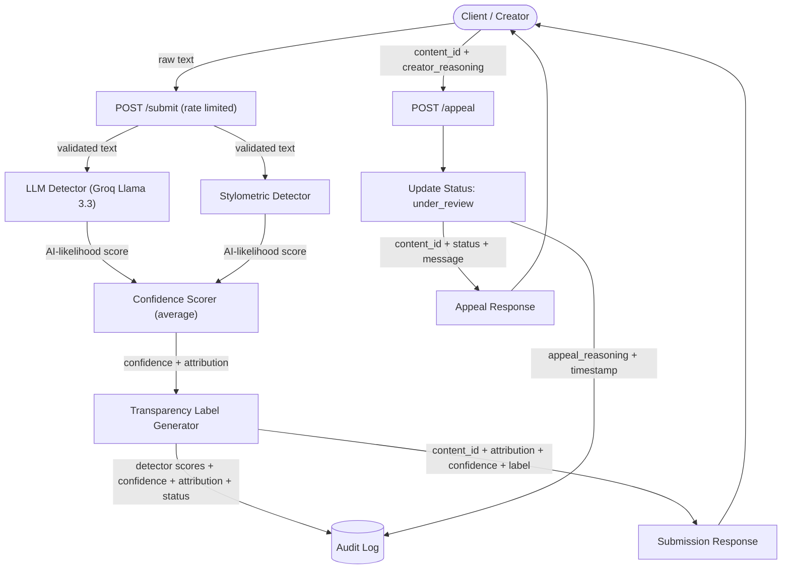

# Provenance Guard

## Overview

Provenance Guard is a Flask backend that analyzes text submissions using two independent detection signals, combines them into a confidence score, generates a transparency label, records every decision in an audit log, and allows creators to submit appeals.

---

## Architecture

### Submission Flow



A client submits text to `POST /submit`, where the text is validated and analyzed by an LLM detector and a stylometric detector. Their two AI-likelihood scores are averaged into a confidence score, mapped to an attribution result, converted into a transparency label, recorded in the audit log, and returned to the client. If the creator later submits an appeal, the submission's status is updated to **under_review** and the appeal is recorded in the same audit log without recalculating the original scores.

---

## Detection Signals

### Signal 1 – LLM Classifier

- **Measures:** Overall writing style, coherence, tone, and semantic patterns (via Groq Llama 3.3).
- **Why chosen:** It reads the writing as a whole and understands context and meaning, not just surface patterns.
- **Limitation:** It is probabilistic and may misclassify unusual or highly polished human writing.

### Signal 2 – Stylometric Heuristics

- **Measures:** Sentence length variation, vocabulary diversity (type-token ratio), punctuation density, and average sentence length.
- **Why chosen:** It is fast, deterministic, and explainable, relying only on measurable writing patterns.
- **Limitation:** It does not understand meaning and is unreliable on very short text, so it returns a neutral score below 15 words.

---

## Confidence Scoring

### Scoring Approach

The LLM score and stylometric score are averaged (each counts equally) to produce one confidence score between **0.0** and **1.0**, which decides the final attribution. The uncertainty range is intentionally wide because a false positive, meaning labeling a person's writing as AI-generated, is worse than an uncertain result. Keeping the range wide lets borderline cases stay in the safer **Uncertain** band.

### Confidence Ranges

| Confidence | Result |
|------------|--------|
| 0.00–0.29 | Likely Human |
| 0.30–0.69 | Uncertain |
| 0.70–1.00 | Likely AI |

### Example Results

| Sample | Confidence | Result |
|---------|-----------:|--------|
| Clearly human-written | 0.20 | Likely Human |
| Clearly AI-generated | 0.90 | Likely AI |

These examples show that the score changes with the input instead of always returning the same result, and that borderline submissions land in the **Uncertain** range instead of being forced into a confident answer.

---

## Transparency Labels

The exact label text returned by the API for each attribution result:

### High-confidence Human

> "This content is likely human-written. Our analysis found strong evidence that this text was written by a person."

### Uncertain

> "We could not confidently determine whether this content is AI-generated or human-written. The available evidence is inconclusive."

### High-confidence AI

> "This content is likely AI-generated. Our analysis found strong evidence that AI tools were used to create or significantly assist this text."

---

## Appeals Workflow

Any creator can submit an appeal to `POST /appeal` using a **content_id** and **creator_reasoning** (both required). The system locates the matching submission in the audit log, updates its status from `classified` to **under_review**, records the `appeal_reasoning` and an appeal timestamp in the same entry, and returns a confirmation message. The original attribution, confidence score, and detector scores are kept as they were, and the content is never automatically reclassified.

---

## Rate Limiting

**Limit** (applied only to `POST /submit`)

- 10 requests per minute
- 100 requests per day

**Reasoning**

These limits are high enough for one creator submitting several drafts in a row, but low enough to stop automated flooding of the submission endpoint and the paid LLM API behind it. `POST /appeal` and `GET /log` are not rate limited.

**429 Test Output** (13 rapid requests to `/submit`)

```text
request  1 -> 200
request  2 -> 200
request  3 -> 200
request  4 -> 200
request  5 -> 200
request  6 -> 200
request  7 -> 200
request  8 -> 200
request  9 -> 200
request 10 -> 200
request 11 -> 429
request 12 -> 429
request 13 -> 429
```

---

## Audit Log

Every submission records a structured decision entry:

- content_id
- creator_id
- timestamp
- llm_score
- stylometric_score
- confidence
- attribution
- status
- appeal_reasoning and appeal_timestamp (added only if appealed)

Example (`GET /log`):

```json
[
  {
    "content_id": "a1b2...",
    "creator_id": "user1",
    "timestamp": "2026-07-04T18:12:03.114Z",
    "llm_score": 0.80,
    "stylometric_score": 0.58,
    "confidence": 0.69,
    "attribution": "uncertain",
    "status": "classified"
  },
  {
    "content_id": "c3d4...",
    "creator_id": "user2",
    "timestamp": "2026-07-04T18:15:41.902Z",
    "llm_score": 0.10,
    "stylometric_score": 0.30,
    "confidence": 0.20,
    "attribution": "likely_human",
    "status": "classified"
  },
  {
    "content_id": "a1b2...",
    "creator_id": "user1",
    "timestamp": "2026-07-04T18:12:03.114Z",
    "llm_score": 0.80,
    "stylometric_score": 0.58,
    "confidence": 0.69,
    "attribution": "uncertain",
    "status": "under_review",
    "appeal_reasoning": "I wrote this myself from personal experience.",
    "appeal_timestamp": "2026-07-04T19:02:10.551Z"
  }
]
```

---

## Known Limitations

- A single long sentence can still read as more AI-like because its high average sentence length raises the score, even though sentence-length variation is treated as neutral for one-sentence input.
- Lightly edited AI text may appear human-written when human revisions weaken both detection signals, pushing the result into the Uncertain range.
- Very short text (under 15 words) does not provide enough structure for reliable stylometric analysis, so that signal returns a neutral 0.5.

---

## Spec Reflection

### How the spec helped

Writing the architecture diagram and planning document first let me build each component (detectors, confidence scorer, label generator, appeals) independently, since each milestone mapped to a clearly defined section of the spec. The spec fixed the important details up front: the two detection signals, the averaging rule, the confidence thresholds, and the exact label wording. That let me hand the AI one section at a time and check its output against a single source of truth instead of redesigning as I went. It also kept the pieces consistent, since the confidence thresholds in the scorer and the label boundaries came from the same document, and the transparency labels matched the spec word for word.

### Where implementation differed

The plan listed the four stylometric metrics as an equal set. In the implementation I weighted them differently. Sentence-length variation and average sentence length count more (0.30 each) than vocabulary diversity and punctuation density (0.20 each), because punctuation density turned out to be the noisiest signal. I also return a neutral 0.5 for very short or single-sentence text instead of scoring it, because those samples do not have enough structure to measure reliably.

---

## AI Usage

For the first milestone I directed the AI to generate the Flask app skeleton, the `POST /submit` endpoint, and the LLM detection signal (Signal 1), providing the architecture diagram and the Detection Signals section of the spec as context. It produced a working application structure, an endpoint that validates the `text` and `creator_id` fields, and a Groq-backed detector that prompts Llama 3.3 for a structured AI-likelihood score. I reviewed the output against the planning document and made several deliberate changes: I kept the detector in its own module so it stayed independent of the scoring logic, added error handling so the function returns a neutral 0.5 on any API or parsing failure instead of crashing the endpoint, and confirmed the returned score was always clamped to the [0.0, 1.0] range the spec requires.

For the second milestone I asked the AI to build the stylometric detector and the confidence scoring module and to connect both signals to the submission flow. It generated a detector covering the four metrics named in the spec (sentence-length variation, vocabulary diversity, punctuation density, and average sentence length), along with a scorer that averages the two signals and maps the result to the attribution thresholds. Here I overrode more of the output. I first checked that the thresholds matched the Uncertainty Representation section exactly, with cut points at 0.30 and 0.70, then adjusted the stylometric detector after testing, since its first version scored some human writing as AI-like. I gave the noisier metrics (punctuation density and vocabulary diversity) less weight than the two structural ones, and changed the detector to return a neutral score for very short or single-sentence text, which the first version had wrongly flagged as strongly AI-generated.

---

## Portfolio Walkthrough

https://www.loom.com/share/d48c84e22fcf4c86bea74965b162368f 

---

## Running the Project

Requires a `GROQ_API_KEY` in a `.env` file (used by the LLM detector).

```bash
pip install -r requirements.txt

python app.py
```

The server runs on `http://localhost:5001`. Example requests:

```bash
# Analyze a submission (POST)
curl -X POST http://localhost:5001/submit \
  -H "Content-Type: application/json" \
  -d '{"text": "your text here", "creator_id": "user1"}'

# Appeal a prior classification (POST)
curl -X POST http://localhost:5001/appeal \
  -H "Content-Type: application/json" \
  -d '{"content_id": "PASTE_ID", "creator_reasoning": "This is my own writing."}'

# View the audit log (GET)
curl http://localhost:5001/log
```

---