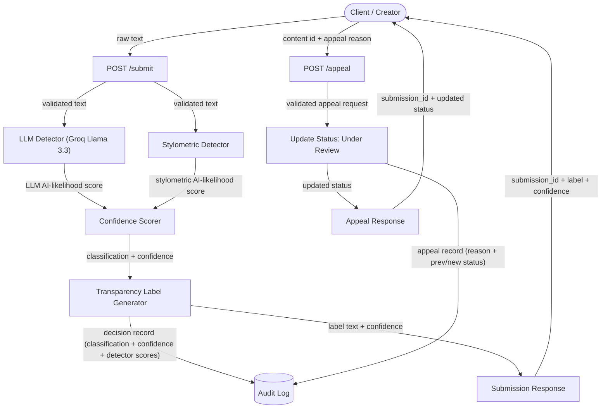

# Provenance Guard — Planning

---

## Detection Signals

### Signal 1: LLM Classifier (Groq Llama 3.3)

- **Measures:** Overall writing style, coherence, tone, and semantic patterns.
- **Output:** An AI-likelihood score between **0.0 and 1.0**, where 0.0 means the text appears human-written and 1.0 means it appears AI-generated.
- **Strengths:** Understands context and writing quality.
- **Limitations:** Can confidently misclassify polished human writing or heavily edited AI writing.

### Signal 2: Stylometric Heuristics

- **Measures:** Statistical writing features, including sentence length variation, vocabulary diversity (type-token ratio), punctuation density, and average sentence length.
- **Output:** An AI-likelihood score between **0.0 and 1.0**, where higher values indicate the writing appears more AI-generated based on its structural patterns.
- **Strengths:** Fast, deterministic, and explainable.
- **Limitations:** Does not understand meaning and is less reliable on short pieces of text.

### Confidence Scoring

Both detectors produce an AI-likelihood score between **0.0 and 1.0**. The system combines the two scores by calculating their average, producing a final confidence score between **0.0 and 1.0**.

The final confidence score is used to determine the attribution result and transparency label. Using two independent signals makes the final decision more reliable than relying on either detector alone.

---

## Uncertainty Representation

The confidence score represents how strongly the two detection signals agree on whether the text is AI-generated or human-written. A score close to **0.5** means the signals are uncertain or disagree, while scores closer to **0.0** or **1.0** indicate higher confidence.

The system calculates the confidence score by averaging the two AI-likelihood scores produced by the LLM classifier and the stylometric detector.

The transparency label is determined using these thresholds:
- **Likely Human:** confidence score **0.00–0.29**
- **Uncertain:** confidence score **0.30–0.69**
- **Likely AI:** confidence score **0.70–1.00**

I chose a wide uncertainty range (0.30–0.69) because a false positive (labeling a human's work as AI-generated) is worse than a false negative. 

---

## Transparency Label Design

The system displays one of three transparency labels based on the final confidence score.

| Result | Label Text |
|--------|------------|
| **High-confidence AI** | "This content is likely AI-generated. Our analysis found strong evidence that AI tools were used to create or significantly assist this text." |
| **High-confidence Human** | "This content is likely human-written. Our analysis found strong evidence that this text was written by a person." |
| **Uncertain** | "We could not confidently determine whether this content is AI-generated or human-written. The available evidence is inconclusive." |

---

## Appeals Workflow

The creator of a submission can submit an appeal if they believe their content was misclassified. The appeal includes the submission ID and a written explanation of why they disagree with the result.

When an appeal is received, the system updates the submission's status to **Under Review** and records the appeal in the Audit Log along with the original classification, confidence score, appeal reason, and timestamp. The system does not automatically reclassify the content.

A human reviewer would see the submission ID, original classification, confidence score, transparency label, appeal reason, current status, and timestamps for both the original decision and the appeal.

---

## Anticipated Edge Cases

**Poetry or song lyrics:** Poems and lyrics often use repetition, simple vocabulary, and short sentences. The stylometric detector may incorrectly classify this writing as AI-generated because its structure is more uniform than typical prose.

**Highly edited AI-generated content:** A person may heavily revise AI-generated text by changing the wording, sentence lengths, and punctuation. This can make the writing appear more human, reducing both detectors' confidence and leading to an uncertain or incorrect classification.

These cases show why the system combines two independent detection signal, reports a confidence score instead of a binary answer, and allows creators to appeal classifications they believe are incorrect.

---
## Architecture

### Architecture Narrative

**Submission flow:** 
A client submits raw text to `POST /submit`, which validates the request and sends the text to two independent detectors running in parallel—an LLM classifier (Groq Llama 3.3) and a stylometric heuristics detector. Their AI-likelihood scores are combined by the Confidence Scorer into a classification and confidence score, converted into a human-readable transparency label, logged in the Audit Log, and returned to the client.

**Appeal flow:** A client submits a content ID and appeal reason to `POST /appeal`, which validates the request, updates the submission's status to **Under Review**, records the appeal in the same Audit Log, and returns the updated status to the client.

---

## AI Tool Plan

### Milestone 3: Submission Endpoint + First Signal

- **Spec sections to provide:** Architecture diagram and **Detection Signals**.
- **Ask the AI to generate:** A Flask app skeleton, the `POST /submit` endpoint, and the LLM classifier function.
- **Verification:** Test the classifier with several sample texts to confirm it returns a valid AI-likelihood score before connecting it to the endpoint.

### Milestone 4: Second Signal + Confidence Scoring

- **Spec sections to provide:** Architecture diagram, **Detection Signals**, and **Uncertainty Representation**.
- **Ask the AI to generate:** The stylometric detector, confidence scoring logic, and integration with the first signal.
- **Verification:** Test clearly human-written and AI-generated samples to confirm the confidence scores and classifications vary as expected.

### Milestone 5: Production Layer

- **Spec sections to provide:** Architecture diagram, **Transparency Label Design**, and **Appeals Workflow**.
- **Ask the AI to generate:** Transparency label generation, the `POST /appeal` endpoint, audit logging, and status updates.
- **Verification:** Confirm all three transparency labels can be produced, appeals change the submission status to **Under Review**, and both decisions and appeals are recorded in the Audit Log.